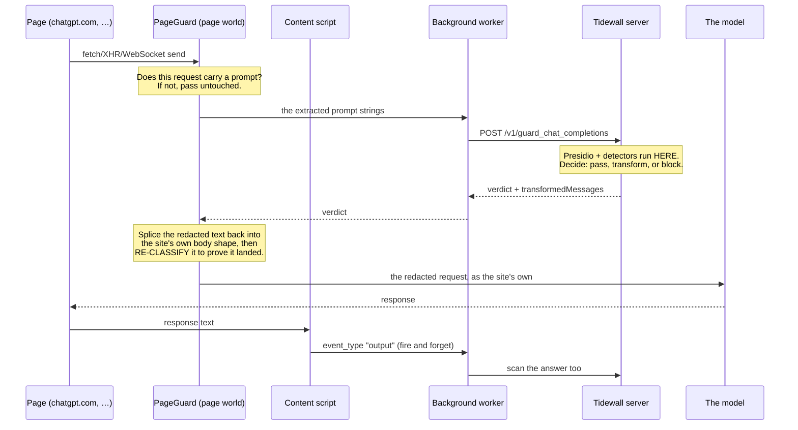

# Tidewall Extension

Browser extension for Tidewall — monitors, redacts, and blocks prompts
sent to AI chat sites (ChatGPT, Claude, Gemini, Copilot, Perplexity,
DeepSeek, and ~32 other GenAI applications).

The extension intercepts outbound network requests in the browser,
extracts the prompt text using site-specific handlers, and routes the
prompt through a Tidewall guard server before allowing the request to
proceed. Block / transform / allow decisions are applied inline.

## Supported Browsers

| Browser | Status | Build target |
| --- | --- | --- |
| Chrome | Supported | Manifest V3 |
| Edge | Supported | Manifest V3 (uses the Chrome build) |
| Firefox | Supported | Manifest V2 fallback via WXT |
| Safari | Planned | — |

A single TypeScript codebase (powered by [WXT][wxt]) targets all browsers.
Use `npm run build` for Chrome/Edge and `npm run build:firefox` for Firefox.

[wxt]: https://wxt.dev/

## Supported Sites

37 sites at launch — full list in [`lib/constants.ts`](./lib/constants.ts).
Major sites include:

ChatGPT, Claude, Gemini, Copilot, M365 Copilot, Perplexity, DeepSeek,
Grok, Meta AI, Mistral, AI Studio (Google), Poe, You.com, Glean,
Salesforce, Character AI, Notion, iAsk, DALL-E, OpenArt, Copy AI,
Sigma, Joyland, FlowGPT, Pi, Phind, Sakura, AnonChatGPT, ChatGOT,
GPT Online, Askan AI, Kuki, Here For You, Yodayo, Charstar, DeftGPT,
Dopple.

Each site has its own handler that knows how to extract the user's
prompt from that site's specific request payload (fetch body, XHR
form data, WebSocket message, etc.).

## Quick Start

```bash
npm install
npm run build         # Chrome/Edge build → .output/chrome-mv3/
npm run build:firefox # Firefox build  → .output/firefox-mv2/
```

Load the unpacked extension into your browser:

- **Chrome / Edge**: `chrome://extensions` → Developer mode →
  "Load unpacked" → select `.output/chrome-mv3/`.
- **Firefox**: `about:debugging` → "This Firefox" → "Load Temporary
  Add-on" → select any file in `.output/firefox-mv2/`.

Once loaded, click the extension icon and register the device against your
Tidewall server URL using a registration token (`rt_*`).

Registration normally leaves the device **pending**: the popup shows a
confirmation code, and an administrator matches that code against the pending
device before activating it. Until then the extension holds credentials and
cannot call the guard. A registration token can be configured to pre-authorize
its devices, which skips the approval step — at the cost of making the token
sufficient on its own.

## Architecture

```
            Page world                  Content script          Background
        ┌──────────────────────┐    ┌──────────────────┐    ┌────────────────┐
HTTP →  │ capture.ts           │    │ content.ts       │    │ background.ts  │
        │  patches fetch, XHR, │    │  picks the site  │    │  holds the     │
        │  WebSocket           │    │  handler, relays │ msg│  credentials,  │
        │                      │ ev │  prompts, shows  │───►│  calls the     │
        │ lib/page-guard.ts    │───►│  notifications   │    │  Tidewall      │
        │  DECIDES: extract,   │    │                  │    │  server        │
        │  ask, prove, refuse  │    │  (relay only)    │    │                │
        └──────────────────────┘    └──────────────────┘    └────────────────┘
```

Three execution contexts cooperate:

1. **Capture script + PageGuard** run in the page world — the same JavaScript
   context as the site itself. They patch `window.fetch`, `XMLHttpRequest` and
   `WebSocket` to intercept outbound requests *before* they are sent, and this
   is where the decision to send, rewrite or block is made and enforced. It has
   to be here: the decision needs the real request body, and only the page world
   has it.
2. **Content script** runs in an isolated extension context. It chooses the
   handler for the current site and relays prompts to the background, and shows
   the user a notification when something was blocked or transformed. It does
   not decide anything.
3. **Background service worker** holds the credentials and makes the
   authenticated calls to the Tidewall server.

## How a prompt is handled

**Detection and redaction happen on the server, not in the extension.** There are
no detectors, entity lists or PII patterns in this codebase — the extension
intercepts, asks, and enforces the answer.



Three properties worth knowing:

**The rewrite must be provable.** A `transform` verdict is not "apply this" — it
is *try to apply this, and block unless it can be shown to have worked*. The
redacted text is spliced back into the site's own request shape and the result is
re-classified. If the rewrite cannot be verified, or if the number of redacted
strings does not match the number extracted, the request is **refused** rather
than sent.

**It fails closed.** A lost reply, a timeout, or a response that is not a
recognisable verdict is a refusal, not a pass. Treating those as a clean scan
would send the original prompt — a leak arriving as an accident rather than a
decision.

**The original never leaves the browser unredacted.** If the guard says transform
and the extension cannot carry that out, nothing is sent at all.

Output scanning is deliberately *not* one of these: the model's answer is sent
for scanning fire-and-forget, after the fact. It records what came back; it does
not gate it.

## Talking to the server

The extension holds three credentials, none interchangeable:

| Credential | Obtained | Reaches |
| --- | --- | --- |
| `rt_` registration token | from an administrator | `POST /v1/devices/enrol`, nothing else |
| `dr_` refresh token | at enrolment | that device's refresh route only; never rotates |
| `at_` access token | at enrolment and each refresh | the guard |

Enrolment yields a **pending** device: it holds credentials and cannot call the
guard until an administrator approves it against a confirmation code the
extension displays. A device the server has revoked stops permanently and offers
a manual resume, because re-enrolling would undo its own revocation.

## Site Handlers

Each supported site has a small handler in
[`handlers/`](./handlers) that implements the extraction interface
defined by [`handlers/base.ts`](./handlers/base.ts):

```typescript
class MySiteHandler extends SiteHandler {
  override promptHttpInput(body: unknown): string[] {
    // Parse body, return user prompts
  }

  override metaHttpInput(body: unknown): void {
    // Optional: extract user/model metadata
  }

  override logResponse(): void {
    // Optional: capture AI response after streaming finishes
  }
}
```

Handlers are unit-tested with Vitest — 200+ tests live in
[`tests/handlers/`](./tests/handlers).

## Tests

```bash
npm test            # all tests
npm run test:watch  # watch mode
```

## Modes

The extension's per-site behaviour is pushed from the Tidewall server
during device check:

| Mode | Behaviour |
| --- | --- |
| `block` | Inline guard call; block / transform applied to the prompt before it leaves the browser |
| `log` | Inline guard call; result logged but request always passes through |
| `discover` | No guard call; just track which sites the user visits |
| `disabled` | Handler is not loaded for this site |

## License

Apache License 2.0. See [LICENSE](./LICENSE) and [NOTICE](./NOTICE).

## Contributing

See [CONTRIBUTING.md](./CONTRIBUTING.md). Vulnerability reports go to
[SECURITY.md](./SECURITY.md).
